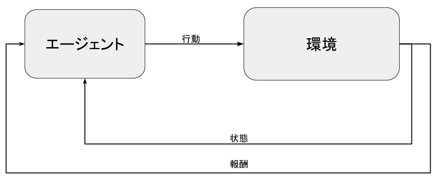

# はじめに

2014年以降,ゲーム市場における消費支出でモバイルゲームがPCゲーム,家庭用ゲームを抜き１位になり[^app_market],モバイルゲームは成長性が高い市場である.
Voodoo社[^voodoo]はApp Storeの全世界ダウンロード数でGoogle社に次いでアプリダウンロード数2位に位置し,ゲームパブリッシャーではダウンロード数世界第1位である.Voodoo社が手掛けるゲームのカテゴリは,カジュアルゲームと呼ばれる.
カジュアルゲームの特徴として,まずグラフィックがシンプルで,操作が非常に簡単である,マニュアルなどもほとんど無く,すぐにゲームが始められる内容である.
一方で,非常に高度なゲーム要素があり,難易度のバランスが絶妙でユーザーを飽きさせない工夫がされており,中毒性の高いゲーム内容になっている.
カジュアルゲームにおける,難易度のバランス（ゲームレベルデザイン)は人間の手によって調整されている.
難易度の評価は一般的には,人間がプレイすることによって決定される.この難易度の評価はゲームバランスに大きく影響を及ぼすため重要なプロセスになる.このプロセスはコストの高い作業となるためゲーム作成における課題である.

本論文では,ステージ制のカジュアルゲームを対象として,ステージを自動生成する.自動生成されたステージを強化学習を用いて学習済みのエージェントにプレイさせ,ステージの難易度を自動的に設定する.強化学習による難易度付けと人間の評価を比較して評価する.
学習の環境の作成および学習にUnity ml-agents[@unity-ml]プラットフォームを使用した.

本論文の構成は以下の通りである.第１章では本論文の背景,目的について,第2章では本論文における事前知識について,第3章では強化学習を用いたゲームレベルデザインの提案手法について,第４章では現時点における実験結果について,第５章では現時点での結果第６章で将来における課題,まとめについて述べる.

# 強化学習
強化学習とは試行錯誤によって学習行う機械学習の１種である.強化学習ではエージェントと呼ばれる行動の主体とエージェントの行動に対して反応を返す環境の相互作用によって学習を行う.環境はエージェントの行動によって報酬と次状態を生成する.報酬はエージェントの行動の評価である.次状態はエージェントの行動によって環境に生じた変化を表す.マルコフ決定過程は,このエージェントと環境の相互作用を数理モデルである.[@fig:mac]にモデルを示す.

{#fig:mac}

## ML-Agents
Unity Machine Learning Agents(ML-Agents)[@unity-ml]はゲーム開発環境であるUnityにおいて強化学習などの機械学習を使用できる環境を提供しているプラグインである.機械学習のバックエンドとしてtensorflow[@tensorflow]が使用されている.
他の学習環境であるViZDoom[@vizdoom]やMalmo[@malmo]と比較して優れている点としてUnity APIの強力な支援を得られる点や,高精度な物理環境が整っている点,既存のゲームに依存しない点,さらに学習アルゴリズムが事前に実装されている点などがある.

## Shikaku
Shikakuは今回作成したゲームである.[@fig:shikaku]にゲームのプレイ画面を示す.
黄色の立方体はプレイヤである.ゲームクリアのためのタスクとしてプレイヤはステージ上に存在する他のオブジェクト(箱)を集めることである.プレイヤの立方体が他の立方体に接触するとその２つが結合し1つのオブジェクトとなる.また,プレイヤとの接触時に結合しない壁が存在する.

{#fig:shikaku}

# 強化学習を用いた難易度レベルデザイン
レベルデザインとしてこれまでに用いられた手法としてSuper Mario BrothersのステージをGANを用いて生成する手法[@mario-gan]やDoomのステージを生成するGAN[@doom-gan]などが登場している.これらの手法を用いて生成されたステージにおいてはステージの難易度について問われることはなかった.
また,GANを用いた手法においては学習にサンプルデータが必要となる.
新しくゲーム作成する場合においては学習のための既存データが存在しないためGANを用いた生成が困難である.

強化学習は事前知識なしで,経験により学習を行うことができるため,サンプルデータを必要としない.

## 構成
{#fig:level-design}

 [@fig:level-design]に難易度レベルデザインの構成を示す.
 Generatorはステージの生成器である.Generatorはプレイヤーの初期位置,取得できる箱および壁の位置,大きさをランダムに自動生成する.Generatorは生成したステージが実際にタスクを達成可能かを保証しない.Generatorが生成する箱および壁が生成する個数の最小値と最大値を設定できる.強化学習では達成不可能なタスクにおいてはタスク達成のための解法を学習することができないため,タスクの達成が可能なステージを今回５ステージのみ作成した.EStageは既存ステージの集合である.
 ArrangerはEStageをパラメータを多少調節することで既存のステージを元に新しくステージを生成する.
 Agentが受け取る情報としてプレイヤの速度,回転速度,回転角,箱,壁のプレイヤとの相対位置,大きさである.
 [@tbl:reward] にAgentがEnviromentから受け取る報酬とその条件を示す.

| 報酬条件                     | 報酬値 |
|------------------------------|--------|
| プレイヤがタスク未達成       | -0.01  |
| オブジェクトに結合           | +0.3   |
| タスクを達成                 | +1     |
| タイムアウト時にタスク未達成 | -1     |
| ゲームオーバー               | -1     |
:報酬の割り当て {#tbl:reward}

## フロー

[@fig:level-design]によって実際に学習していく際の手順について説明する.

1. EStageを用いてエージェントを学習
2. 1で学習したエージェントを用いてArrangerで生成したステージをプレイし,プレイ可能なステージを選別する
3. Arrangerで生成したステージでエージェントを学習
4. 3.で学習したエージェントを用いてGeneratorで生成したステージをプレイし,プレイ可能なステージを選別する
5. Generatorで生成したステージでエージェントを学習
6. Generatorで生成できる箱と壁の個数の最大値を増やし 4,5を繰り返し行いエージェントの学習を行う.

Generatorのエージェント学習の際に使用するステージはEStageで学習したエージェントやArrangerで学習したエージェントより学習に使用したステージと違い,既存のステージに依存しないため,より多様性のあるステージを用いて学習ができる.
一般に,学習時における環境の多様性はエージェントの汎化能力が獲得できる[@rl-generalization]ため,EStage,Arranger,Generatorと生成した(保持する)ステージを用いて学習したエージェントはより段階が進むに従って汎化能力が得られると考えられる.

# 実験
現時点では評価結果などのデータが全て収集できていないため,評価方法について述べる.

## ステージ難易度設定の評価手法

エージェントはステージの難易度を決定する手法として,以下のフローで行う

1. エージェントは評価するステージを規定回数プレイし,ステージをクリアできた回数を計測する

2. クリア回数に応じて５段階で評価を行う.

同様に人間のプレイヤに同じステージでプレイしてもらい評価してもらう.

評価するステージはGeneratorで生成し,プレイヤがタスク実行が可能できるようプレイが可能であることを確かめた上で使用する.

[@fig:stages] に評価する10ステージを示す.

{#fig:stages}

エージェントの評価の比較対象として人間による評価との類似度によってエージェントの評価能力を評価する.
エージェントのプレイ能力(ゲームのプレイのうまさ)によって人間の評価と
の類似度は変化するため.人間の評価を基準としてエージェント能力を比較する.

人間とエージェントのプレイの類似式を[@eq:eval-diff]に示す.

$$ E =  \frac{\sum_{i=0}^{n} (eh_i - ea_i)} {n}  $$ {#eq:eval-diff}

$n$は評価したステージ数.
$eh_i$はi番目のステージにおける人間の難易度評価である.$ea_i$はi番目のステージにおけるエージェントの難易度評価である.

$E$が正の場合エージェントは人間のプレイと比較して,よりプレイ能力が高い.反対に値が負の場合エージェントは人間よりプレイ能力が低い.この値がより小さいほどエージェントと人間のプレイが同程度の能力であることを示す.

## 実験結果および考察

現時点では実験結果が取りきれていないので結果の評価および考察は省略する.

# まとめ
本論文では,カジュアルゲームの難易度レベルデザインに対して強化学習を用いて評価を行い,既存データが少ない環境において自動生成と強化学習で汎化能力を手に入れる方法を提案した.実験結果については,現時点では評価結果の収集が終了していないため,評価方法のみを提案した.

## 課題
現在この手法の評価において,少人数の人間の評価を元に行なっているが,さらに多くの人数から評価を集めることで難易度をより細分化できるようにし,プレイヤに沿った難易度を提案できるようにする必要がある.

強化学習を用いてステージの評価はできるが,現段階においてステージ生成のジェネレータはヒューリスティックに作成している.このため,ジェネレータを作成するというコストに対して,DoomGAN[@doom-gan]などと同様に生成することでより自動化が提案できる.
また,ステージのタスク可能判定について,強化学習のエージェントを用いて判定を行なっているが,これをステージデータおよびそのタスクの可否をエージェント用いてステージのデータセットを生成する.これによって,前提知識を学習することが可能になると考えられる.

# 参考文献

[^app_market]: https://www.appannie.com/jp/insights/market-data/idc-mobile-gaming-report-2017/#download
[^voodoo]: https://socialappsupport.com/column/voodoo/
